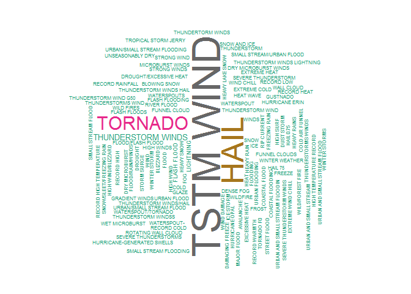

# StromEvents

Table: Documented Weather Events in Report

Event Type              Event Type                Event Type                 Event Type          
----------------------  ------------------------  -------------------------  --------------------
Astronomical Low Tide   Extreme Cold/Wind Chill   Hurricane (Typhoon)        Storm Surge/Tide    
Avalanche               Flash Flood               Ice Storm                  Strong Wind         
Blizzard                Flood                     Lake-Effect Snow           Thunderstorm Wind   
Coastal Flood           Frost/Freeze              Lakeshore Flood            Tornado             
Cold/Wind Chill         Funnel Cloud              Lightning                  Tropical Depression 
Debris Flow             Freezing Fog              Marine Hail                Tropical Storm      
Dense Fog               Hail                      Marine High Wind           Tsunami             
Dense Smoke             Heat                      Marine Strong Wind         Volcanic Ash        
Drought                 Heavy Rain                Marine Thunderstorm Wind   Waterspout          
Dust Devil              Heavy Snow                Rip Current                Wildfire            
Dust Storm              High Surf                 Seiche                     Winter Storm        
Excessive Heat          High Wind                 Sleet                      Winter Weather      
  

